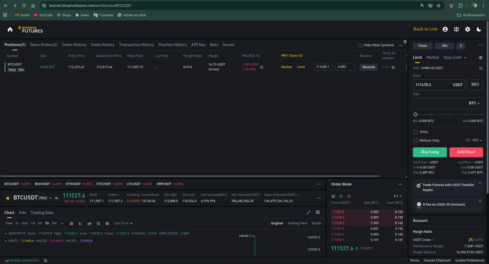

# Analysis Report: Binance Futures Trading Bot

**Author:** Avinash Kushwaha  
**Date:** September 10, 2025

---

## 1. Objective

The objective of this assignment was to develop a command-line interface (CLI) based trading bot for the Binance USDT-M Futures Testnet. The bot was required to support mandatory order types (Market, Limit) and at least one advanced order type as a bonus, while implementing robust logging and clear documentation.

## 2. Methodology

The solution was developed in Python and structured according to the submission guidelines. Key components include:

- **Modular Scripts:** Each order type (`market`, `limit`, `stop-limit`) is handled by a dedicated, executable Python script. This ensures clear separation of concerns.
- **Shared Client:** A `client.py` utility was created to handle the API connection, authentication, and logging setup. This avoids code duplication and centralizes the connection logic.
- **Secure Credential Handling:** API keys are loaded from a `.env` file using the `python-dotenv` library, ensuring they are not hardcoded into the source code.
- **Robust Logging:** The `logging` module is used to record all major actions, API responses, and errors to `bot.log` for debugging and auditing purposes.

## 3. Results & Verification

The bot was successfully tested on the Binance Futures Testnet. The following screenshot confirms a successful MARKET BUY order of 0.001 BTC was placed and a position was opened on the BTCUSDT perpetual market.

**Screenshot of a successful trade:**

